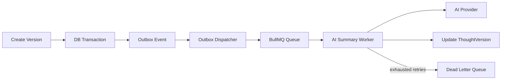

# Research: resumo de IA assíncrono com BullMQ e outbox

## Questions

- What does the current implementation look like?
- What patterns does this project follow?
- Where are the integration points?
- How should AI summary generation move from synchronous processing to asynchronous processing with BullMQ?
- How can the flow guarantee retry, backoff and dead-letter queue handling?
- How should idempotency be enforced for automatic jobs and manual retries?
- Where should the outbox pattern be applied to avoid losing work between PostgreSQL and Redis?

## Findings

### Implementação atual

- A geração de resumo de IA está acoplada ao fluxo síncrono de `ThoughtVersionService.create`.
- Ao criar uma versão com predecessor, o serviço:
  - valida o pensamento;
  - carrega a última versão;
  - cria a nova `ThoughtVersion` com `aiSummaryStatus: PENDING`;
  - calcula o diff com `diffWords`;
  - persiste `ThoughtDiff`;
  - atualiza a versão para `PROCESSING`;
  - chama `generateAiSummary`;
  - atualiza a versão para `COMPLETED` com `aiSummary`, ou para `FAILED` com `aiSummaryErrorMessage`.
- Para a primeira versão de um pensamento, o status é `NOT_APPLICABLE` e a IA não é chamada.
- O método `retryAiSummary` repete o mesmo processamento de forma síncrona, usando o `ThoughtDiff` persistido para reconstruir o payload da chamada de IA.
- O endpoint `POST /:thoughtId/versions/:versionId/ai-summary` é idempotente apenas no caso em que a versão já está `COMPLETED`: ele retorna a versão existente sem chamar a IA novamente.

### Modelo de dados e contratos existentes

- `AiSummaryStatus` já existe no domínio e no Prisma com os estados `NOT_APPLICABLE`, `PENDING`, `PROCESSING`, `COMPLETED` e `FAILED`.
- `ThoughtVersion` persiste `aiSummary`, `aiTags`, `aiSummaryStatus` e `aiSummaryErrorMessage`.
- `ThoughtDiff` guarda os dados necessários para reprocessamento: `fromVersionId`, `toVersionId`, `addedWords`, `removedWords` e `metrics`.
- O contrato `GenerateAiSummary` recebe conteúdo antigo, conteúdo novo, palavras adicionadas/removidas e métricas; ele não conhece versão, fila, tentativas ou persistência.
- Não há dependência atual de BullMQ, Redis, filas, workers, outbox ou DLQ no projeto.

### Pontos de integração

- `src/feature/thought-version/service/thought-version.service.ts`: hoje concentra a orquestração de criação de versão, diff e geração síncrona do resumo.
- `src/feature/thought-version/service/thought-version-ai.service.ts`: implementação atual da chamada OpenAI.
- `src/feature/thought-version/repository/thought-version.repository.ts`: contrato para ler e atualizar status, resumo e mensagem de erro.
- `src/feature/thought-diff/repository/thought-diff.repository.ts`: contrato para recuperar o diff necessário para geração/reprocessamento.
- `src/routes/thought.routes.ts`: composição manual de dependências e rotas HTTP.
- `prisma/schema.prisma`: local onde seriam adicionadas as tabelas de outbox e, se necessário, campos auxiliares de idempotência/controle operacional.

### Arquitetura assíncrona proposta

O fluxo principal deve criar a versão e registrar a intenção de gerar resumo em uma outbox na mesma transação de banco. A publicação para BullMQ deve acontecer depois, por um dispatcher de outbox. Assim, se a API gravar a versão mas cair antes de falar com Redis, o trabalho não é perdido.

Fluxo recomendado:

- `ThoughtVersionService.create` continua responsável por validar entrada, carregar aggregate, criar versão e calcular/persistir diff.
- A criação de `ThoughtVersion`, `ThoughtDiff` e `OutboxEvent` deve ocorrer na mesma transação Prisma.
- A versão deve sair da requisição HTTP com `aiSummaryStatus: PENDING`, sem bloquear a resposta esperando a IA.
- Um dispatcher busca eventos pendentes na outbox, publica jobs na fila BullMQ e marca o evento como publicado.
- O job deve ter `jobId` determinístico, por exemplo `ai-summary:${thoughtVersionId}`, para evitar duplicidade no Redis.
- Um worker BullMQ processa o job, carrega versão e diff, valida idempotência, marca a versão como `PROCESSING`, chama `generateAiSummary` e finaliza com `COMPLETED`.
- Se todas as tentativas do BullMQ forem esgotadas, o fluxo deve registrar `FAILED`, persistir uma mensagem sanitizada em `aiSummaryErrorMessage` e encaminhar o caso para uma DLQ.

### Retry, backoff e DLQ

- O retry operacional deve ficar no BullMQ, não em loops manuais no service HTTP.
- A fila de geração pode usar `attempts`, `backoff` exponencial e jitter, por exemplo `attempts: 5` e `backoff: { type: "exponential", delay: 30000 }`.
- Erros transitórios de IA, rede, rate limit e indisponibilidade do provider devem ser elegíveis a retry.
- Erros permanentes de consistência, como versão inexistente, diff inexistente ou status `NOT_APPLICABLE`, não devem consumir todas as tentativas; devem falhar de forma controlada e registrar diagnóstico.
- A DLQ pode ser implementada como uma fila BullMQ separada, por exemplo `ai-summary.dead-letter`, alimentada por listener de `failed` quando `attemptsMade >= opts.attempts`.
- A entrada da DLQ deve conter dados mínimos e auditáveis: `thoughtVersionId`, `thoughtId`, `diffId` quando disponível, erro sanitizado, quantidade de tentativas, timestamps e causa classificada.
- O reprocessamento da DLQ deve recolocar um novo evento/job com o mesmo identificador lógico, respeitando idempotência.

### Idempotência

- A unidade idempotente do resumo deve ser a versão de destino: uma `ThoughtVersion` deve ter no máximo um resumo final para seu `id`.
- O `jobId` do BullMQ deve ser determinístico por `thoughtVersionId`, evitando múltiplos jobs ativos iguais.
- A tabela de outbox deve ter uma chave única lógica, por exemplo `(eventType, aggregateId)` para `AI_SUMMARY_REQUESTED` + `thoughtVersionId`.
- O worker deve verificar o estado antes de chamar a IA:
  - se `COMPLETED`, finalizar sem chamar o provider;
  - se `NOT_APPLICABLE`, descartar como falha permanente ou no-op explícito;
  - se `FAILED` e o job veio de retry manual, permitir novo processamento;
  - se `PENDING`, assumir o processamento;
  - se `PROCESSING`, só continuar se o job possuir o lease/lock esperado ou se houver estratégia de recuperação para processamentos travados.
- A transição para `PROCESSING` deve ser condicional no banco, por exemplo atualizar apenas quando o status atual estiver em `PENDING` ou em `FAILED` para retry manual.
- O resultado também deve ser salvo de forma condicional para evitar que um worker antigo sobrescreva um resultado mais novo.
- Para retries manuais via API, o endpoint deve deixar de executar a IA diretamente e passar a reenfileirar a intenção. Se a versão já estiver `COMPLETED`, deve manter o comportamento idempotente de retornar o resultado existente.

### Outbox pattern

- O outbox pattern é necessário porque a criação da versão ocorre no PostgreSQL e o job assíncrono será publicado no Redis/BullMQ. Sem outbox, uma falha entre `prisma.create` e `queue.add` pode deixar uma versão permanentemente `PENDING`.
- A outbox deve ser persistida no mesmo commit que cria a versão e o diff.
- Campos sugeridos para `OutboxEvent`:
  - `id`;
  - `eventType`, por exemplo `AI_SUMMARY_REQUESTED`;
  - `aggregateType`, por exemplo `ThoughtVersion`;
  - `aggregateId`, usando `thoughtVersionId`;
  - `payload`, com `thoughtId`, `thoughtVersionId`, `fromVersionId`, `diffId` se houver;
  - `status`, por exemplo `PENDING`, `PUBLISHED`, `FAILED`;
  - `attempts`;
  - `nextAttemptAt`;
  - `publishedAt`;
  - `lastError`;
  - `createdAt` e `updatedAt`.
- O dispatcher deve publicar no BullMQ com `jobId` determinístico e só marcar o evento como `PUBLISHED` após `queue.add` retornar com sucesso.
- Se o dispatcher publicar e falhar antes de marcar `PUBLISHED`, uma próxima execução pode tentar publicar de novo; o `jobId` determinístico evita duplicação efetiva na fila.
- A outbox não substitui os retries do worker. Ela protege a publicação do job; BullMQ protege o processamento do job.

### Separação em camadas

- A regra de negócio de quando um resumo é aplicável continua no domínio/aplicação de versões.
- A aplicação deve orquestrar criação da versão, diff e registro da intenção assíncrona.
- A infraestrutura deve conter BullMQ, Redis, worker, dispatcher de outbox e implementação Prisma dos novos repositórios.
- Controllers/rotas devem continuar limitados a receber input, chamar o caso de uso/service e devolver resposta.
- `generateAiSummary` pode continuar como porta/função de integração com IA, mas sua chamada deve sair do caminho síncrono da request.

## Recommendations

- Introduzir BullMQ e Redis como infraestrutura de processamento assíncrono, com uma fila principal `ai-summary` e uma fila de DLQ `ai-summary.dead-letter`.
- Criar um modelo de outbox no Prisma e um repositório de outbox na infraestrutura. A criação de versão, diff e evento `AI_SUMMARY_REQUESTED` deve acontecer em uma única transação.
- Alterar o fluxo de `ThoughtVersionService.create` para retornar a versão com `aiSummaryStatus: PENDING` quando houver predecessor, sem chamar `generateAiSummary` durante a request.
- Criar um dispatcher de outbox que publique eventos pendentes no BullMQ com `jobId: ai-summary:${thoughtVersionId}`.
- Criar um worker de resumo de IA que carregue `ThoughtVersion` e `ThoughtDiff`, aplique as regras de idempotência, atualize status para `PROCESSING`, chame `generateAiSummary` e persista `COMPLETED` ou `FAILED`.
- Configurar retry e backoff no BullMQ para falhas transitórias e mover falhas esgotadas para DLQ com contexto suficiente para auditoria e reprocessamento.
- Refatorar `retryAiSummary` para reenfileirar o trabalho em vez de chamar a IA diretamente. Para versões `COMPLETED`, manter retorno idempotente sem reenfileirar.
- Diferenciar retry automático de retry manual no payload ou em metadados do job, para permitir reprocessar versões `FAILED` somente quando a intenção for explícita.
- Usar atualizações condicionais por status ou um campo de lease/lock para impedir que dois workers processem a mesma versão ao mesmo tempo.
- Adicionar observabilidade mínima: logs estruturados por `thoughtVersionId`, métricas de jobs concluídos/falhos, tamanho da DLQ, idade dos eventos de outbox pendentes e tempo médio até `COMPLETED`.
- Cobrir com testes:
  - criação de versão registra outbox e não chama IA;
  - dispatcher publica job com `jobId` determinístico;
  - worker não chama IA quando versão já está `COMPLETED`;
  - worker marca `COMPLETED` em sucesso;
  - worker preserva erro sanitizado e envia para DLQ quando retries esgotam;
  - retry manual reenfileira versões `FAILED` e mantém idempotência para `COMPLETED`.

## Files Examined

- [docs/research/template.md](template.md) — estrutura esperada para documentos de research.
- [docs/research/thought-version-ai-summary-retry.md](thought-version-ai-summary-retry.md) — research anterior sobre status e retry síncrono do resumo de IA.
- [src/feature/thought-version/service/thought-version.service.ts](../../src/feature/thought-version/service/thought-version.service.ts) — fluxo atual de criação, retry, status e chamada síncrona da IA.
- [src/feature/thought-version/service/thought-version-ai.service.ts](../../src/feature/thought-version/service/thought-version-ai.service.ts) — integração atual com OpenAI para geração do resumo.
- [src/feature/thought-version/repository/thought-version.repository.ts](../../src/feature/thought-version/repository/thought-version.repository.ts) — contrato atual para persistir resumo, status e mensagem de erro.
- [src/feature/thought-version/repository/prisma-thought-version.repository.ts](../../src/feature/thought-version/repository/prisma-thought-version.repository.ts) — implementação Prisma do repositório de versões.
- [src/feature/thought-version/thought-version.model.ts](../../src/feature/thought-version/thought-version.model.ts) — modelo TypeScript de versão e enum `AiSummaryStatus`.
- [src/feature/thought-version/thought-version.types.ts](../../src/feature/thought-version/thought-version.types.ts) — contrato `GenerateAiSummary` e tipos de entrada/saída de versão.
- [src/feature/thought-diff/repository/prisma-thought-diff.repository.ts](../../src/feature/thought-diff/repository/prisma-thought-diff.repository.ts) — persistência e recuperação dos diffs necessários para reprocessamento.
- [src/routes/thought.routes.ts](../../src/routes/thought.routes.ts) — rotas e composição atual das dependências de pensamento e versões.
- [prisma/schema.prisma](../../prisma/schema.prisma) — modelos Prisma atuais de `ThoughtVersion`, `ThoughtDiff` e enum de status.
- [package.json](../../package.json) — dependências atuais; não há BullMQ ou Redis configurados.
