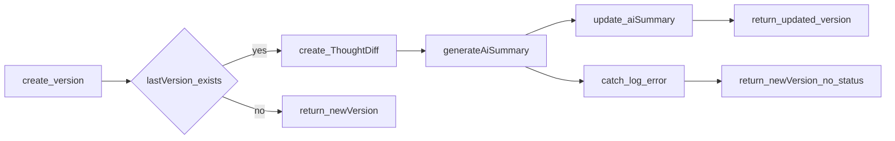

# Research: retry de resumo de IA e status de processamento

## Questions

- Onde e quando o resumo de IA é gerado hoje?
- O que acontece em caso de erro na geração?
- Como o cliente ou a API distingue “nunca tentou”, “falhou” e “ainda sem resumo por outro motivo”?
- Que dados são necessários para repetir a geração do resumo de uma versão?
- Quais são os pontos de integração (persistência, OpenAI, rotas) relevantes para um endpoint de nova tentativa?

## Findings

### Onde e quando o resumo é gerado

- A geração ocorre apenas em `ThoughtVersionService.create`, depois de criar a nova versão e, **se existir** uma versão anterior (`lastVersion`), de calcular o diff e persistir um `ThoughtDiff`.
- Se **não** existe versão anterior (primeira versão do pensamento), o fluxo retorna a versão criada **sem** chamar a IA — não há resumo nesse caminho.

### Comportamento em sucesso e em falha

- Em sucesso: `generateAiSummary` é chamada com conteúdo antigo, novo, palavras adicionadas/removidas e métricas; o resultado é persistido com `thoughtVersionRepository.update` no campo `aiSummary`.
- Em falha: o erro é registado com `console.error` e o método devolve `newVersion` **sem** atualizar `aiSummary`. O campo continua `null` como no registo recém-criado. **Não há** estado persistido que indique que a geração falhou — para o consumidor, `aiSummary: null` não distingue falha de IA de primeira versão (sem tentativa) ou qualquer outro caso sem texto.

### Modelo de dados

- No Prisma, `ThoughtVersion` expõe `aiSummary` (opcional) e `aiTags`; não existe coluna ou enum para estado do processamento da IA.
- O modelo de domínio TypeScript (`ThoughtVersion`) espelha isso: `aiSummary: string | null`, `aiTags: string[]`, sem campo de status.

### Integração com a IA

- `generateAiSummary` (OpenAI, ficheiro `thought-version-ai.service.ts`) valida `OPENAI_API_KEY`, lê o template em `prompts/thought-version-diff.md`, chama `chat.completions` e trata resposta vazia ou erros genéricos como `AppError.internalError`.

### API atual

- Existem listagem de versões e criação de versão (`GET .../versions`, `POST .../:thoughtId/versions` em `thought.routes.ts`). Não há rota dedicada a regenerar ou reintentar o resumo.

### Dados necessários para uma nova tentativa

- A assinatura atual de `GenerateAiSummary` exige: `oldContent`, `newContent`, `addedWords`, `removedWords`, `metrics`.
- Para a versão “destino” do resumo (tipicamente `toVersionId` no `ThoughtDiff`), isso corresponde ao conteúdo da versão anterior, conteúdo da nova versão e o mesmo tipo de informação de diff já produzida em `create` — reutilizável a partir do registo `ThoughtDiff` (ligação `fromVersionId` → `toVersionId`) ou recalculando o diff entre as duas versões.

## Recommendations

- **Persistir estado do processamento do resumo** na entidade `ThoughtVersion` (ou equivalente), por exemplo um enum Prisma: valores mínimos sugeridos — *pendente*, *em processamento*, *concluído*, *falha*; e *não aplicável* quando não há versão anterior e portanto não há geração de resumo neste fluxo. Opcional: `aiSummaryErrorMessage` (ou código) só preenchido em *falha*, para diagnóstico sem expor detalhes sensíveis na API pública (avaliar o que expor no DTO).
- **Alinhar criação com o estado**: ao falhar a IA em `create`, atualizar o registo com status de falha em vez de devolver apenas `null` em `aiSummary` sem semântica.
- **Endpoint de nova tentativa** (exemplo de forma REST): `POST` sobre o recurso da versão, p.ex. `POST /.../thoughts/:thoughtId/versions/:versionId/ai-summary` (ajustar ao prefixo real das rotas). Regras: validar que `versionId` pertence a `thoughtId`; carregar o par `from`/`to` via `ThoughtDiff` onde `toVersionId` é a versão alvo (ou definir comportamento explícito se o diff não existir); chamar a mesma `generateAiSummary`; persistir `aiSummary` e o novo status.
- **Idempotência (decisão em aberto)**: quando o resumo já existe e o status é *concluído*, definir se o endpoint devolve 200 com o resumo existente, 409, ou 204 — documentar a escolha na especificação da API.
- **Separação em camadas**: manter orquestração no service / caso de uso, contratos de repositório para persistir status e texto, controller apenas com validação de entrada, chamada ao caso de uso e mapeamento de resposta — consistente com DDD já referenciado nas regras do projeto.

## Files Examined

- [docs/research/template.md](template.md) — estrutura do documento de research.
- [src/feature/thought-version/service/thought-version.service.ts](../../src/feature/thought-version/service/thought-version.service.ts) — fluxo `create`, chamada à IA e tratamento de erro.
- [src/feature/thought-version/thought-version.types.ts](../../src/feature/thought-version/thought-version.types.ts) — tipo `GenerateAiSummary` e DTOs relacionados.
- [src/feature/thought-version/thought-version.model.ts](../../src/feature/thought-version/thought-version.model.ts) — forma atual do agregado/DTO de versão exposto pela aplicação.
- [prisma/schema.prisma](../../prisma/schema.prisma) — modelo `ThoughtVersion` e relações.
- [src/routes/thought.routes.ts](../../src/routes/thought.routes.ts) — rotas existentes para versões e criação de pensamento.
- [src/feature/thought-version/service/thought-version-ai.service.ts](../../src/feature/thought-version/service/thought-version-ai.service.ts) — implementação de `generateAiSummary` e falhas.
- [src/feature/thought-version/repository/thought-version.repository.ts](../../src/feature/thought-version/repository/thought-version.repository.ts) — contrato `create`/`update` para campos `aiSummary` / `aiTags`.
